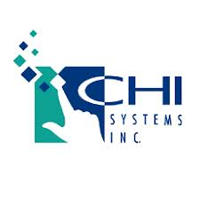

# Sponsors

<table>

<tr><td>

</td>
<td><a href="https://www.elsevier.com/">Elsevier</a></td>
<td>2018, 2019</td></tr>

<tr><td>

</td>
<td><a href="https://www.journals.elsevier.com/artificial-intelligence">Artificial Intelligence Journal</a></td>
<td>2017, 2019</td></tr>

<tr><td>

</td>
<td><a href="https://www.springer.com/">Springer</a></td>
<td>2018</td></tr>

<tr><td>

</td>
<td><a href="http://www.wpafb.af.mil/afrl/afosr/">Air Force Office of Scientific Research</a></td>
<td>2003, 2004, 2007, 2010, 2017</td></tr>
  
<tr><td>

</td>
<td><a href="http://www.onr.navy.mil/">Office of Naval Research</a></td>
<td>2001, 2004, 2006, 2007, 2010, 2017</td></tr>

<tr><td>

</td>
<td><a href="https://ist.psu.edu/">College of Information Sciences and Technology</a></td>
<td>2016</td></tr>

<tr><td>

</td>
<td><a href="http://www.nsf.gov/">National Science Foundation</a></td>
<td>2001, 2004, 2007, 2010, 2016</td></tr>

<tr><td>

</td>
<td><a href="http://www.cra.com/">Charles River Analytics</a></td>
<td>2007, 2016</td></tr>

<tr><td>

</td>
<td><a href="http://www.soartech.com/">Soar Technology</a></td>
<td>2007, 2009, 2016</td></tr>

<tr><td>

</td>
<td><a href="http://caffeinezone.net/">caffeinezone.net</a></td>
<td>2016</td></tr>

<tr><td>

</td>
<td><a href="http://www.dfg.de/en/index.jsp">DFG, German Research Foundation</a></td>
<td>2003, 2012</td>
</tr><tr><td>

</td>
<td><a href="http://www.freunde.tu-berlin.de/">Gesellschaft von Freunden der TU Berlin e.V.</a></td>
<td>2012</td>
</tr><tr><td>

</td>
<td><a href="http://cognitivesciencesociety.org/">Cognitive Science Society</a></td>
<td>2006, 2009, 2010, 2012</td>
</tr><tr><td>

</td>
<td><a href="http://www.london.af.mil">European Office of Aerospace Research &amp; Development</a></td>
<td>2003, 2006, 2009, 2012</td>
</tr><tr><td>

</td>
<td><a href="http://www.gk-ev.de/index.en.php">German Society for Cognitive Science (GK)</a></td>
<td>2012</td>
</tr><tr><td>

</td>
<td><a href="http://www.wpafb.af.mil/afrl/rh/">Air Force Research Laboratory, Human Effectiveness Directorate</a></td>
<td>2001, 2003, 2004, 2010</td>
</tr><tr><td>

</td>
<td><a href="http://www.aptima.com/">Aptima</a></td>
<td>2010</td>
</tr><tr><td>

</td>
<td><a href="http://www.drexel.edu/">Drexel University</a></td>
<td>2010</td>
</tr><tr><td>

</td>
<td><a href="http://www.dstl.gov.uk/">Defence Science and Technology Laboratory</a></td>
<td>2009</td>
</tr><tr><td>

</td>
<td><a href="http://www.aisb.org.uk/">The Society for the Study of Artificial Intelligence and Simulation of Behaviour</a></td>
<td>2009</td>
</tr><tr><td>

</td>
<td><a href="http://www.lispworks.com/">LispWorks</a></td>
<td>2009</td>
</tr><tr><td>

</td>
<td><a href="http://www.agstechnet.com/">AGS TechNet</a></td>
<td>2009</td>
</tr><tr><td>

</td>
<td><a href="http://sitemaker.umich.edu/soarweb/home">University of Michigan, Center for Cognitive Architecture</a></td>
<td>2007</td>
</tr><tr><td>

</td>
<td><a href="http://www.boeing.com/">Boeing</a></td>
<td>2007</td>
</tr><tr><td>

</td>
<td><a href="http://www.lockheedmartin.com/">Lockheed Martin Advanced Technology Laboratories</a></td>
<td>2007</td>
</tr><tr><td>

</td>
<td><a href="http://www.ict.usc.edu/">Institute of Creative Technology, University of Southern California</a></td>
<td>2007</td>
</tr><tr><td>

</td>
<td><a href="http//www.miur.it/">MIUR: Ministero dell'Istruzione, Università e Ricerca</a></td>
<td>2006</td>
</tr><tr><td>

</td>
<td><a href="http://www.regione.fvg.it/">Regione Autonoma Friuli Venezia Giulia</a></td>
<td>2006</td>
</tr><tr><td>

</td>
<td><a href="http://www.units.it/">Università degli Studi di Trieste</a></td>
<td>2006</td>
</tr><tr><td>

</td>
<td><a href="http://www.arl.army.mil/">United States Army Research Laboratory</a></td>
<td>2004</td>
</tr><tr><td>

</td>
<td><a href="http://www.psy.cmu.edu/">Carnegie Mellon University, Psychology Department</a></td>
<td>2004</td>
</tr><tr><td>

</td>
<td><a href="http://www.nasa.gov">National Aeronautics and Space Administration</a></td>
<td>2004</td>
</tr><tr><td>

</td>
<td><a href="http://www.lrdc.pitt.edu/">University of Pittsburgh Learning Research &amp; Development Center</a></td>
<td>2004</td>
</tr><tr><td>

</td>
<td><a href="http://www.uni-bamberg.de/">Otto-Friedrich Universität Bamberg, Institut für Theoretische Psychologie</a></td>
<td>2003</td>
</tr><tr><td>

</td>
<td><a href="http://www.bmw.com/">Bayerische Motorwerke</a></td>
<td>2003</td>
</tr><tr><td>

</td>
<td><a href="http://www.gmu.edu/">George Mason University</a> <a href="http://www.cas.gmu.edu/">College of Arts and Science</a>, <a href="http://www.gmu.edu/depts/psychology/">Psychology Department</a>, and <a href="http://hfac.gmu.edu/">Human Factors and Applied Cognition</a></td>
<td>2001</td>
</tr><tr><td>

</td>
<td><a href="http://www.chisystems.com/">CHI Systems</a></td>
<td>2001</td>
</tr><tr><td>

</td>
<td><a href="http://www.bbn.com/">Raytheon BBN Technologies</a></td>
<td>2001</td>
</tr>

</table>
