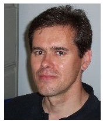

# Steering Committee

<table>
<tr><td></td>  
<td><b>Rick Cooper</b> (<a href="mailto:r.cooper@bbk.ac.uk">r.cooper@bbk.ac.uk</a>)
<ul><li>task control, multitasking, and sequencing
</li></ul>
<b>Affiliations:</b> <a href="http://www.bbk.ac.uk/psychology/">Department of Psychological Sciences</a>, <a href="http://www.bbk.ac.uk/">Birkbeck University of London</a>

</td>
</tr><tr><td></td>
<td><b>Danilo Fum</b> (<a href="mailto:fum@units.it">fum@units.it</a>)
<ul><li>memory and reinforcement
</li></ul>
<b>Affiliations:</b> <a href="http://labsico.units.it">Laboratorio di Sistemi Cognitivi</a>, <a href="http://www.units.it/">University of Trieste</a>

</td>
</tr><tr><td></td>
<td><b>Wayne Gray</b> (<a href="mailto:grayw@rpi.edu">grayw@rpi.edu</a>)
<ul><li>interactive routines for goal-directed cognition
</li></ul>
<b>Affiliations:</b> <a href="http://cogworks.cogsci.rpi.edu/">CogWorks Lab</a>, <a href="http://www.rpi.edu/">Rensselaer Polytechnic Institute</a>

</td>
</tr><tr><td></td>
<td><b>Glenn Gunzelmann</b>
<ul><li>attention and sleep deprivation
</li></ul>
<b>Affiliations:</b> <a href="http://www.afrl.af.mil/">Air Force Research Laboratory</a>

</td>
</tr><tr><td></td>
<td><b>Andrew Howes</b> (<a href="mailto:HowesA@cs.bham.ac.uk">HowesA@cs.bham.ac.uk</a>)
<ul><li>cognitive control and human-computer interaction
</li></ul>
<b>Affiliations:</b> <a href="http://www.cs.bham.ac.uk/">School of Computer Science</a>, <a href="http://www.birmingham.ac.uk">University of Birmingham</a>

</td>
</tr><tr><td></td>
<td><b>Boicho Kokinov</b> (<a href="mailto:bkokinov@nbu.bg">bkokinov@nbu.bg</a>)
<ul><li>parallel and emergent models of anology, deduction, and generalization
</li></ul>
<b>Affiliations:</b> <a href="http://www.nbu.bg/cogs/">Center for Cognitive Science</a>, <a href="http://www.nbu.bg/">New Bulgarian University</a>

</td>
</tr><tr><td></td>
<td><b>John Laird</b> (<a href="mailto:laird@umich.edu">laird@umich.edu</a>)
<ul><li>Soar cognitive architecture
</li></ul>
<b>Affiliations:</b> <a href="http://www.eecs.umich.edu/ai/">Artificial Intelligence Laboratory</a>, <a href="http://www.umich.edu/">University of Michigan</a>

</td>
</tr><tr><td></td>
<td><b>Christian Lebiere</b> (<a href="mailto:cl@cmu.edu">cl@cmu.edu</a>)
<ul><li>game theory, reinforcement, and core architectural questions
</li></ul>
<b>Affiliations:</b> <a href="http://www.psy.cmu.edu/">Psychology Department</a>, <a href="http://www.cmu.edu/">Carnegie Mellon University </a>

</td>
</tr><tr><td></td>
<td><b>Richard Lewis</b> (<a href="mailto:rickl@umich.edu">rickl@umich.edu</a>)
<ul><li>language/memory, reinforcement, and bounded optimality
</li></ul>
<b>Affiliations:</b> <a href="http://www.lsa.umich.edu/psych/">Department of Psychology</a> and <a href="http://www.lsa.umich.edu/linguistics/">Linguistics</a>, <a href="http://www.umich.edu/">University of Michigan</a>

</td>
</tr><tr><td></td>
<td><b>Nele Pape Russwinkel</b> (<a href="mailto:nele.russwinkel@zmms.tu-berlin.de">nele.russwinkel@zmms.tu-berlin.de</a>)
<ul><li>time estimation
</li></ul>
<b>Affiliations:</b> <a href="http://www.tu-berlin.de/zentrum_mensch-maschine-systeme/">Zentrum Mensch-Maschine-Systeme</a>, <a href="http://www.tu-berlin.de/">Technische Universität Berlin</a>

</td>
</tr><tr><td></td>
<td><b>David Peebles</b> (<a href="mailto:d.peebles@hud.ac.uk">d.peebles@hud.ac.uk</a>)
<ul><li>diagrammatic reasoning
</li><li>problem solving using external representations
</li></ul>
<b>Affiliations:</b> <a href="http://www2.hud.ac.uk/hhs/dbs/">Department of Behavioural and Social Sciences</a>, <a href="http://www.hud.ac.uk/">University of Huddersfield</a>

</td>
</tr><tr><td></td>
<td><b>Hedderik van Rijn</b> (<a href="mailto:hedderik@van-rijn.org">hedderik@van-rijn.org</a>)
<ul><li>time perception
</li><li>semantic memory and optimal learning
</li></ul>
<b>Affiliations:</b> <a href="http://research.ai.rug.nl/index.php/cogmod/">Cognitive Modeling Group</a>, <a href="http://www.rug.nl">University of Groningen</a>

</td>
</tr><tr><td></td>
<td><b>Frank Ritter</b> (<a href="mailto:Frank.Ritter@psu.edu">Frank.Ritter@psu.edu</a>)
<ul><li>cognitive modelling tools
</li><li>human-computer interaction
</li></ul>
<b>Affiliations:</b> <a href="http://acs.ist.psu.edu/">Applied Cognitive Science Lab</a>, <a href="http://www.psu.edu/">Penn State University</a>

</td>
</tr><tr><td></td>
<td><b>Dario Salvucci</b> (<a href="mailto:salvucci@cs.drexel.edu">salvucci@cs.drexel.edu</a> )
<ul><li>multitasking
</li></ul>
<b>Affiliations:</b> <a href="http://www.cs.drexel.edu/">Department of Computer Science</a>, <a href="http://www.drexel.edu/">Drexel University</a>

</td>
</tr><tr><td></td>
<td><b>Terrence Stewart</b> (<a href="mailto:tcstewar@uwaterloo.ca">tcstewar@uwaterloo.ca</a>)
<ul><li>large-scale cognitive models using spiking neurons
</li><li>philosophy of modelling
</li></ul>
<b>Affiliations:</b> <a href="http://ctn.uwaterloo.ca/">Centre for Theoretical Neuroscience</a>, <a href="http://uwaterloo.ca/">University of Waterloo</a>

</td>
</tr><tr><td></td>
<td><b>Niels Taatgen</b> (<a href="mailto:niels@ai.rug.nl">niels@ai.rug.nl</a>)
<ul><li>learning and cognitive control
</li></ul>
<b>Affiliations:</b> <a href="http://www.rug.nl/ai">Department of Artificial Intelligence</a>, <a href="http://www.rug.nl/">University of Groningen</a>

</td>
</tr><tr><td></td>
<td><b>Robert West</b> (<a href="mailto:rlwest@carleton.ca">rlwest@carleton.ca</a>) 
<ul><li>SGOMS modelling for sociotechnical systems
</li><li>emotions in ACT-R
</li></ul>
<b>Affiliations:</b> <a href="http://ccmhome.blogspot.ca/">Carleton Cognitive Modelling Lab</a>, <a href="http://www5.carleton.ca/ics/">Institute of Cognitive Science</a>, <a href="http://carleton.ca/">Carleton University</a>

</td>
</tr><tr><td></td>
<td><b>Richard Young</b> (<a href="mailto:r.m.young@acm.org">r.m.young@acm.org</a>) 
<ul><li>complex tasks and human error
</li></ul>
<b>Affiliations:</b> <a href="http://www.ucl.ac.uk/uclic/people/r_young/">UCL Interaction Centre</a>, <a href="http://www.ucl.ac.uk/">University College London</a>

</td>
</tr></table>
